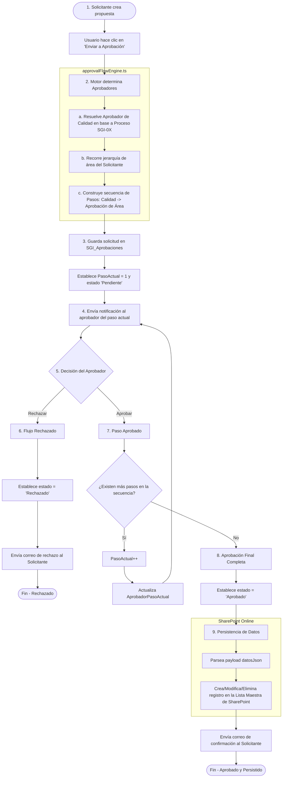

# Diagrama de Procesos del Flujo de Aprobación — SgiPortal

Este documento describe el flujo de vida de una solicitud de aprobación en el **SgiPortal** (crear, modificar o eliminar procesos, KPIs, riesgos, glosario o documentos), representado mediante un diagrama secuencial en Mermaid.

---

## 1. Diagrama de Flujo del Proceso (Mermaid)

---

## 2. Descripción de Fases Clave

### Fase 1: Creación y Enrutamiento (Solicitante)
El usuario redacta una solicitud de cambio en cualquier módulo del portal. Al enviar, el motor de aprobaciones analiza:
1. **Tipo de Elemento:** Determina qué subdepartamento de Calidad (Gestión Documental, Planificación, o Riesgos) debe realizar la revisión inicial.
2. **Origen de Área:** Reconstruye el organigrama del usuario de forma ascendente. Si el usuario pertenece a una **Sección**, el flujo requerirá la firma de la **Sección**, luego del **Departamento**, y finalmente de la **Dirección** (los niveles que existan y tengan un encargado asignado en `SGI_Areas`).

### Fase 2: Ciclo de Firmas Secuenciales (Aprobadores)
* Cada aprobador recibe una notificación de alerta en su bandeja de entrada (y un correo real en producción) detallando el cambio propuesto.
* Las firmas se registran secuencialmente. Si un aprobador intermedio rechaza la propuesta, el flujo se detiene de inmediato, se cancela la solicitud y el solicitante recibe la justificación del rechazo. El cambio propuesto **nunca** llega a la base de datos real.

### Fase 3: Persistencia y Cierre (Sistema)
Cuando el último aprobador de la jerarquía firma favorablemente:
1. El portal toma el campo `datosJson` (que contiene el borrador de los datos).
2. Invoca el repositorio correspondiente (ej. `riskRepository` o `processRepository`) para realizar la operación de escritura definitiva en SharePoint.
3. Se actualiza el estado de la solicitud a **Aprobado** y se notifica al creador que su cambio ya está en producción.
